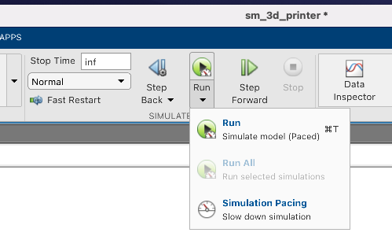
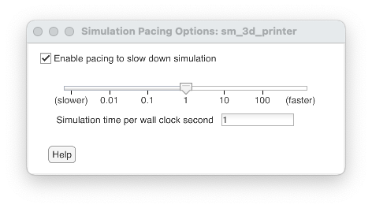

# Matlab course examples

This folder contains two examples developed during the _Digital Manufacturing_ course Department of Industrial Engineering, University of Trento.

The aim of the examples is to briefly show a **digital twin** example where the __c-cnc__ represents the physical machine while the Matlab® and Simulink® simulation represent its digital version.

The cartesian printer model is a modified version of an [this](https://it.mathworks.com/help/physmod/sm/ug/cartesian_3d_printer.html) example provided by Matlab®.

## Examples

* `SimpleAxis`: Simscape® model of a simpifyed machine axis. The axis movement occours through a DC motor which is controlled in position by means of a PID. The axis set point can be set via MQTT.
* `Cartesian3DPrinter`: Simscape® model of a cartesian 3D printer where axes movements are based on the **SimpleAxis** example.

## Projects dependencies

* Simulink and Matlab® r2021b.
* Simscape® multibody.
* Simscape® electrical.
* [MQTT in Matlab toolbox](https://it.mathworks.com/matlabcentral/fileexchange/64303-mqtt-in-matlab)
 
## Project setup and run
1. Launch MQTT broker. Please read carefully the documentation inside __goodies__ folder.
2. Open Matlab, go to __MATLAB__ folder and launch `SimpleAxis.m` or `Cartesian3DPrinter.m`. Both scripts will setup and open their simulink models. 
3. Setup simulink simulation pace to be software realtime.
   Enable **pacing** and set **simulation time per wall clock** to 1. 
4. Run simulation. This will open also the __Mechanics Explorer__ inside your Matlab window.

# Note
1. MQTT topics. 
2. In order to test if your simulation is runnning correctly you can try to set axis/axes set point/points by using _one_ of these Matlab commands:
   ```matlab
   publish(M, '/sp', '0'); % SimpleAxis set point
   ``` 
   or
    ```matlab
   publish(M, '/sp', '0'); % Cartesian3DPrint set point
   ``` 